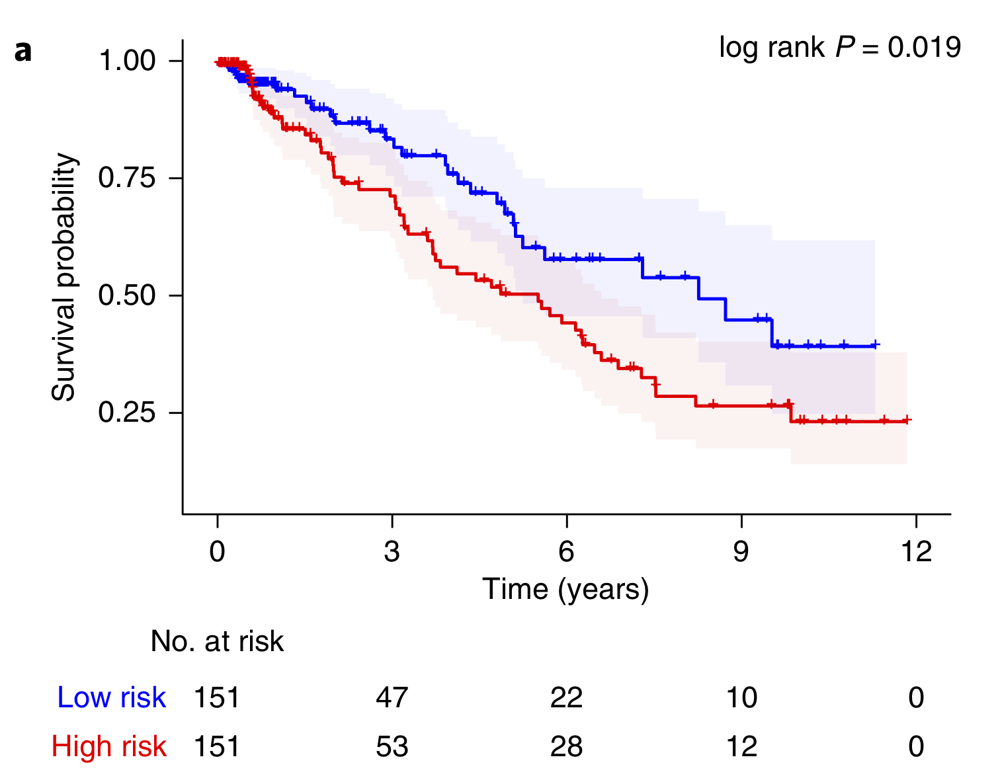
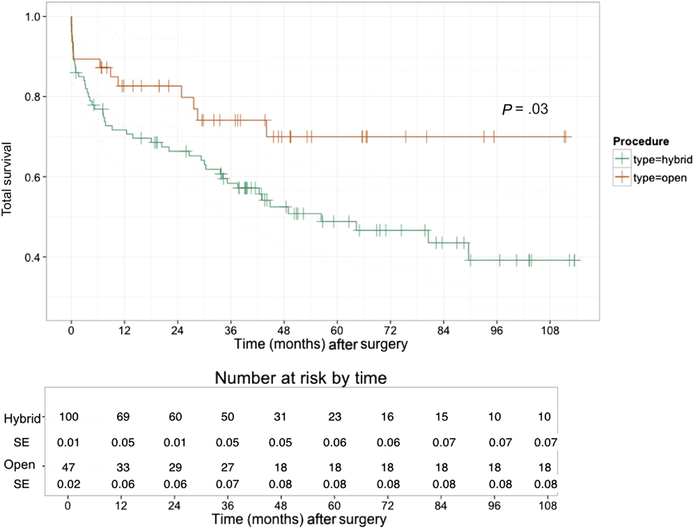
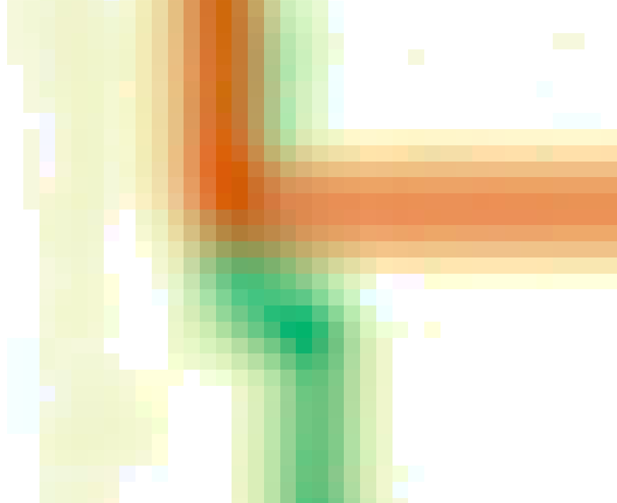
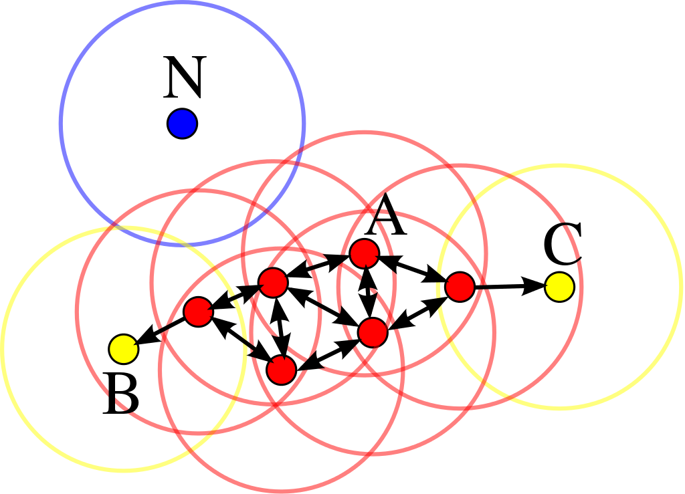
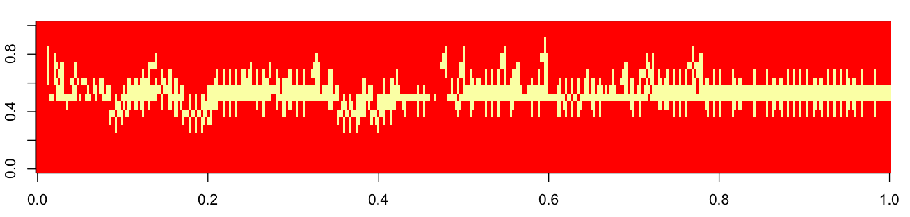
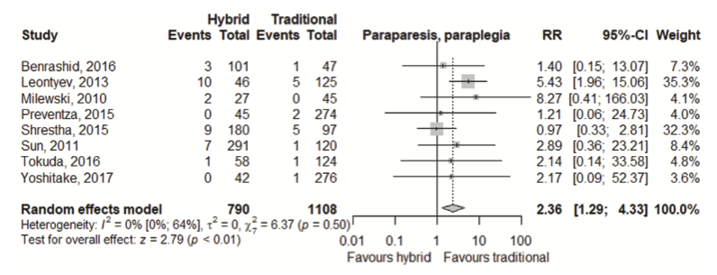
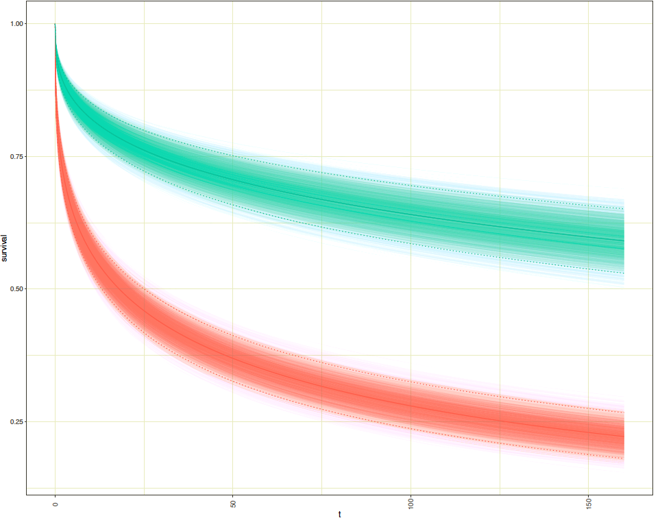
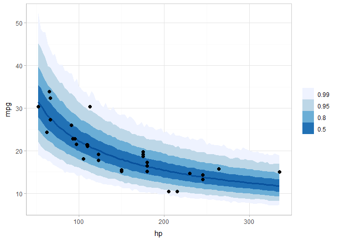
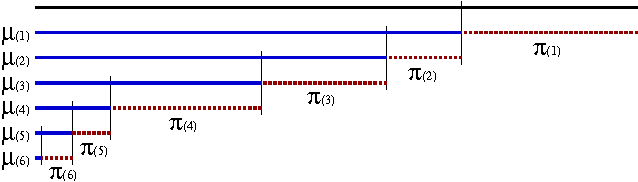

<center>
{height=12cm}
</center>

<br><br>


```{r setup, include=FALSE}
knitr::opts_chunk$set(message = F, fig.align = "center")

library(epuRate)
library(rmarkdown)
library(knitr)
library(dplyr)
library(DT)
library(survival)
library(survminer)

```

# An Example

***

<div class = "row">
  
<div class = "col-md-6">

<center>
**original**



**reconstructed**
</center>

```{r}

load(file = "../4DSurv/4DSurv.RData")
d <- img$survData
d$stratum <- factor(d$stratum, levels = c('low risk', 'high risk'))
f <- survfit(Surv(time, status) ~ stratum, data = d)
ggsurvplot(f, risk.table = T, palette = c("blue", "red"), 
           legend = "none", conf.int = T)

```
</div>
  
<div class = "col-md-6">
```{r}

d$time <- format(round(d$time, 2), nsmall = 2)

datatable(d, rownames = F,
          options = list(
                    pageLength = nrow(d),
                    scrollY = "600px", dom = 't'
                    )
          )

```
</div>
</div>


> Kaplan–Meier plot for a conventional parameter model using a composite of manually derived volumetric measures (left plot) [@4DSurv, p. 97]

<!-- For the purpose of post-analysis or meta-analysis, using charts within the article is sometimes the most accurate approximation when raw data is unavailable in published papers, because of confidentiality. The aim of the R-Package survThief is to reconstruct Individual Patient Data (IPD) from plotted Kaplan Meier survival curves that reflect the actual data used for plotting as closely as possible. -->

{height=1cm}

# Survthief

***

<p class="comment">
**R-package digitizing and reconstructing data underlying images of Kaplan Meyer survival plots**
</p>


## Motivations for a digitization package

***

<p class="comment">
**~ 350'000** <br>
N° articles for the search "Kaplan Meier" on https://bib.kuleuven.be
</p>


<p class="comment">
**5%** <br>
Proportion of articles out of **160** randomly sampled research articles in the BMJ (2009-2015) that shared their dataset. [@dataSharing]
</p>

> "it is an ethical obligation to responsibly share data generated by interventional clinical trials because participants have put themselves at risk." [@dataSharing]

> "The ICMJE [International Committee of Medical Journal Editors] proposed to require that deidentified individual patient data (**IPD**) are made publicly available no later than **six months** after publication of the trial results. This proposal triggered debate. In June 2017, the ICMJE stepped back from its proposal." [@dataSharing]

### the status quo

***

> "In our experience, although little training is required, it takes about **half an hour** to obtain the initial input for one curve. If incorrect data are entered this may trap the algorithm." [@Guyot]

> "The data prepared for the Guyot et al. method should be sufficient, and every step in the KM curves should be captured. **Hundreds of data points** were required for the Guyot et al. method" [@Wan]

### proposed improvement

***

#### digitize {-} 

digitize the curve with one click, at the maximal level of granularity with a "walking" algorithm along the curve. 

#### reconstruct {-}

recognize censoring mark positions with a Hough transform and reconstruct the survival data accordingly. If no censoring marks are available, the package implements Guyot et al's method.

#### IPD survival meta analysis {-}

survival meta analysis on entire dataset instead of on summary statistics.

## preprocessing - colour quantization

***

### the problem {- .tabset .tabset-pills}

#### original {-}

{height=12cm}

#### zoomed {-}

{height=12cm}


<!-- ```{r} -->

<!-- library(EBImage) -->

<!-- p <- "../Reconstructions/reproducing survival meta analysis/Reconstructed/Benrashid/Benrashid original.jpg" -->
<!-- img <- readImage(p) -->
<!-- display(img, method="browser") -->

<!-- ``` -->


### Kmeans

***

<p class="comment">
**Assumptions** <br>
convexity, no outliers, known number of clusters
</p>


$$\underset{\mathbf{S}}{\arg \min } \sum_{i=1}^{k} \sum_{\mathbf{x} \in S_{i}}\left\|\mathbf{x}-\boldsymbol{\mu}_{i}\right\|^{2}$$


```{r}

load("dfSegmented.rds")

library(plotly)

dfSmall <- df[sample(1:nrow(df), 10000),]

# original
library(shiny)
div(plot_ly(dfSmall, size = 0.1, x = ~red, y = ~green, z = ~blue, 
        marker = list(color = ~rgb(dfSmall$red, dfSmall$green, dfSmall$blue),
                      line = list(width = 0))) %>%
  add_markers() %>%
  layout(scene = list(xaxis = list(title = 'R'),
                   yaxis = list(title = 'G'),
                   zaxis = list(title = 'B'))) %>%
  layout(paper_bgcolor='rgb(254, 247, 234)'), align = "center")

```
<center>
**pixels in RGB space (plotting 10'000 sampled points)**
</center>


```{r}

# segmented
div(plot_ly(dfSmall, size = 0.1, x = ~red, y = ~green, z = ~blue, 
        marker = list(color = ~rgb(dfSmall$R, dfSmall$G, dfSmall$B),
                      line = list(width = 0))) %>%
  add_markers() %>%
  layout(scene = list(xaxis = list(title = 'R'),
                   yaxis = list(title = 'G'),
                   zaxis = list(title = 'B'))) %>%
  layout(paper_bgcolor='rgb(254, 247, 234)'), align = "center")

```
<center>
**k-means (k=4) clustered pixels in RGB space (plotting 10'000 sampled points)**
</center>

### Spectral Clustering 

***

<p class="comment">
**Assumptions** <br>
no outliers, known number of clusters
</p>

Define $S$, an $N \times N$ similarities confusion matrix for each possible pairs of points $i$ and $j$ (including $i = j$). 

Each $s_{ij}$ contains the standardized euclidian distance between points $i$ and $j$.

Standardization can be done with different kernels (here $s_{i j}=\exp \left(-d_{i j}^{2} / c\right)$, with scale parameter $c$ was used).

Apply KNN to $S$ and define nearest neighbours. Replace all $s_{ij}$'s corresponding to non-neighbouring points by zero and name the resulting matrix $W$ (more sparse than S).

Define a vector $g$ such that $g_{i}=\sum_{j} w_{i j}$: the sum of the distance weights for each point $i$. Let $G$ be a diagonal matrix with diagonal elements $g_i$'s.
Define the graph Laplacian $L = G - W$ (normalized version $\tilde{\mathbf{L}}=\mathbf{I}-\mathbf{G}^{-1} \mathbf{W}$).

Finally, perform K-means on $L$ [@statLearn, p. 544].


<!-- Traditional clustering methods like K-means use a spherical or elliptical metric to group data points. -->

 <!-- is connected but not necessarily clustered within convex boundaries. -->
 


```{r}

load("sc.rds")

div(plot_ly(data.frame(s), size = 0.1, x = ~X1, y = ~X2, z = ~X3, 
        marker = list(color = ~rgb(sc@centers[sc@.Data, 1], 
                                   sc@centers[sc@.Data, 2], 
                                   sc@centers[sc@.Data, 3]),
                      line = list(width = 0))) %>%
  add_markers() %>%
  layout(scene = list(xaxis = list(title = 'R'),
                   yaxis = list(title = 'G'),
                   zaxis = list(title = 'B'))) %>%
  layout(paper_bgcolor='rgb(254, 247, 234)'), align = "center")

```
<center>
**Spectral Clustering (4 clusters) on a sample of 2'000 points**
</center>


C++ implementation {height=1cm}


https://github.com/yuj-umd/fastsc
https://help.ubuntu.com/community/Arpack%2B%2B

### DB SCAN

***

<p class="comment">
**Assumptions** <br>
none of the above
</p>

**Density based method**

First define two parameters: 

+ $\rho$, maximum radious of a neighbourhood
+ $\phi$ minimum number of point within a neighbourhod

Define *core points*, which satisfy both criteria.
Define *board points* as being in a neighbourhood defined by $\rho$ but that do not satisfy $\phi$.
Define a *core object*, a neighbourhood where both criteria are satisfied.

Define *direct reachability* between two points $i$, $j$: $i$ is directly density reachable from $j$, if $i$ is within $\rho$ of $j$ and $j$ is a *core object*.

Define *generic reachability* between two points $i$, $j$: there exists a chain of points $k_1, k_2, ..., k_n$, where $k_1 = i$ and $k_n = p$, such that each point is *directly reachable* from the next one in the chain. 

Group accordingly and discard points that are uncreachable by any other as noise [@dbscan].

<center>
{height=4cm}
</center>


```{r}

load("dbscan.rds")

div(plot_ly(data.frame(s), size = 0.1, x = ~red, y = ~green, z = ~blue, 
        marker = list(color = ~rgb(s$centerRed, s$centerGreen, s$centerBlue),
                      line = list(width = 0))) %>%
        # color = K$cluster) %>%
  add_markers() %>%
  layout(scene = list(xaxis = list(title = 'R'),
                      yaxis = list(title = 'G'),
                      zaxis = list(title = 'B'))) %>%
  layout(paper_bgcolor='rgb(254, 247, 234)'), align = "center")

```
<center>
**DBScan (neighborhood size: 0.35) on a sample of 20'000 points**
</center>


### colour buckets [naive approach]

***

<center>

</center>

Wikipedia Definition:

$\begin{equation}
H :=\left\{\begin{array}{ll}{0,} & {\text { if } M A X=M I N \Leftrightarrow R=G=B} \\ {60^{\circ} \cdot\left(0+\frac{G-B}{M A X-M I N}\right),} & {\text { if } M A X=R} \\ {60^{\circ} \cdot\left(2+\frac{B-R}{M A X-M I N}\right),} & {\text { if } M A X=G} \\ {60^{\circ} \cdot\left(4+\frac{R-G}{M A X-M I N}\right),} & {\text { if } M A X=B}\end{array}\right.
\end{equation}$

$\text { if } H<0^{\circ} \text { then } H :=H+360^{\circ}$

$\begin{equation}
S :=\left\{\begin{array}{ll}{0,} & {\text { if } M A X=0 \Leftrightarrow R=G=B=0} \\ {0,} & {\text { if } M I N=1 \Leftrightarrow R=G=B=1} \\ {\frac{M A X-M I N}{1-|M A X+M I N-1|}=\frac{2 M A X-2 L}{1-|2 L-1|}=\frac{M A X-L}{\min (L, 1-L)},} & {\text { otherwise }}\end{array}\right.
\end{equation}$

$\begin{equation}
L :=\frac{M A X+M I N}{2}
\end{equation}$


```{r, fig.height= 1, fig.cap= "hue range and colour buckets (fixing saturation and lightness at 1/2)"}

library(plotwidgets)
fundCols <- hsl2rgb(t(cbind(seq(360*1/12, 360*11/12, 360*2/12), 0.5, 0.5)))
background <- hsl2rgb(t(cbind(seq(1, 360), 0.5, 0.5)))

library(ggplot2)
ggplot() + geom_rect(aes(xmin=0:359, xmax=1:360, ymin=-1, ymax=0), 
                     fill = rgb(t(background), maxColorValue = 255)) +
  geom_rect(aes(xmin=seq(0, 300, 60), xmax=seq(60, 360, 60), ymin=0, ymax=1), 
                     fill = rgb(t(fundCols), maxColorValue = 255)) +
  theme_void()

```

## Supported Input

***

### images

```{r, echo = T}
magick::magick_config() %>% unlist %>% subset(. == T) %>% names
```

### pdf  {height=1cm}

{width=100% height=10cm}

## types of images

***

- with at risk table

  - with censoring marks -> survThief

  - without censoring marks -> Guyot

- without at risk table

  - with censoring marks -> ? {height=1cm}

  - without censoring marks -> Guyot


## Reconstruction

***

```{r, message=F, out.width='\\textwidth', results = 'hide'}
library(mvbutils)
library(survThief)

foodweb(where="package:survThief",
        boxcolor = "#FC6512", textcolor = "black",
        cex = 0.7, lwd=2)
```


### survThief workflow


#### UI

*digi*, *digiData*

#### Walking Algorithm

*walk*, *jump*, *fillGap*

#### Detect Censoring

*detectCensoring*




#### Combine atRisk table, censoring marks and walk

*adjCensored*, *censoredAtRisk*

#### Method when no censoring mark is available

*guyot*

### survThief script by function {.tabset .tabset-pills}

```{r child = 'survThiefFunctions.Rmd'}
```


# Method Evaluation

***

Simulating from

$$S(t)=Weib(\gamma, \lambda) = \exp \left(-\lambda t^{\gamma}\right)$$

$\gamma$ and $\lambda$ shape and scale respectively.

$\begin{equation}
E(\mathrm{X})=\lambda \Gamma(1+1 / \gamma)
\end{equation}$

assumes properly behaved data

[@simGH]

Blur images?

# Meta Survival Analysis

***

<center>

[@meta]
</center>

## meta showcase 

***

Reconstructed images:

```{r, echo = F, out.width="50%"}
p <- "../Reconstructions/reproducing survival meta analysis/Reconstructed"
myimages <- list.files(p, pattern = "original", full.names = TRUE, recursive = T)

library(knitr)
include_graphics(myimages)

```

Not reconstructed yet

```{r, echo = F, out.width="50%"}
p <- "../Reconstructions/reproducing survival meta analysis/Not Yet"
myimages <- list.files(p, pattern = "original", full.names = TRUE, recursive = T)

library(knitr)
include_graphics(myimages)

```

## reconstructed data

***

```{r}

load("../../reproducing survival meta analysis/meta.RData")

colnames(d)[1] <- "time in months"

datatable(cbind(format(round(d[1], 4)), d[-1]), 
          editable = TRUE,rownames = F,
          options = list(
                    pageLength = nrow(d), 
                    scrollY = "400px", dom = 't'
                    )
          )

```


potential variables: median age at study start. {height=1cm}

## modelling

***

### Kaplan Meier

***

$$\widehat{S}(t)=\prod_{i : t_{i} \leq t}\left(1-\frac{d_{i}}{n_{i}}\right)$$

```{r}

## KM

colnames(d)[1] <- "time"

library(survival)
fit <- survfit(Surv(time, status) ~ stratum, data=d)

library(survminer)
## pdf("results/detectCensoring V2.pdf",width=14,height=10)
KMPlot <- ggsurvplot(fit, risk.table = T, tables.theme = theme_cleantable(),
           risk.table.col = "strata", RUEpval = TRUE, 
           ggtheme = theme_bw(), risk.table.y.text=F,
           break.time.by=12)

KMPlot

```


### Bayesian Weibull regression {.tabset .tabset-pills}

***

<!-- conjugate priors -->

$$\begin{equation}
p\left(t_{i} | \boldsymbol{x}_{i}, v_{i}, \boldsymbol{\beta}, \alpha\right)=\alpha^{v_{i}} t_{i}^{v_{i}(\alpha-1)} \exp \left(v_{i} \boldsymbol{\beta}^{\mathrm{T}} \boldsymbol{x}_{i}-t_{i}^{\alpha} \exp \left(\boldsymbol{\beta}^{\mathrm{T}} \boldsymbol{x}_{i}\right)\right)
\end{equation}$$

intercept and shape:

$$
\begin{equation}
\begin{aligned} \beta_{0} & \sim \mathrm{N}\left(0,10^{2}\right) \\ \log \alpha & \sim \mathrm{N}\left(0,10^{2}\right) \end{aligned}
\end{equation}
$$

covariates:

$$\begin{equation}
\begin{aligned} \beta_{j} & \sim \mathrm{N}\left(0, \sigma_{s}^{2} \sigma_{j}^{2}\right), \text { for } j=1, \ldots, m_{b g} \\ \sigma_{j}^{2} & \sim \operatorname{Inv}-\chi^{2}(1), \text { for } j=1, \ldots, m_{b g} \\ \sigma_{s} & \sim \operatorname{Half}-\mathrm{N}\left(0,10^{2}\right) \end{aligned}
\end{equation}$$

original Weibull:

$$x \sim W \operatorname{eib}(\alpha, \lambda) = \lambda \alpha x^{\alpha-1} e^{-\lambda x^{\alpha}}$$


#### KM overlay and credible intervals {-}

```{r}

load("weibFit.rds")

# library(RColorBrewer)
# myColors <- brewer.pal(2,"Set1")
# names(myColors) <- levels(stanWeibFitSurvMean$treatment)
# colScale <- scale_colour_manual(name = "treatment",values = myColors)

KMPlot$plot + geom_line(data = stanWeibFitSurvMean,
                   mapping = aes(x = t,y = survival_mean, group = treatment, color = treatment)) + 
  geom_line(data = stanWeibFitSurvMean,
                   mapping = aes(x = t,y = survival_95upper, group = treatment, color = treatment), linetype = "dotted") + 
  geom_line(data = stanWeibFitSurvMean,
                   mapping = aes(x = t,y = survival_95lower, group = treatment, color = treatment), linetype = "dotted")


```

#### Posterior draws {-}

<center>

</center>

#### cred bands (evtl) {-}



#### Model Checking - Rhat {-}

```{r}
load("../../reproducing survival meta analysis/weibFit.RData")

s <- capture.output(stanWeibFit)
library(stringr)
sVars <- word(s[6:length(s)], 1)

print(stanWeibFit, pars = sVars[1:15])

```


#### Model Checking - chains {-}

```{r}

library(rstan)
traceplot(stanWeibFit, par = c("alpha","mu","beta_bg"))
```


#### Model Checking - autocorrelation {-}

```{r}
library(bayesplot)
mcmc_acf(as.matrix(stanWeibFit), pars = c("alpha","mu","beta_bg[1]"))
mcmc_areas(as.matrix(stanWeibFit), pars = c("alpha","mu","beta_bg[1]"), prob = 0.95)
```

#### Model Checking - parameter significance {-}

```{r}
mcmc_areas(as.matrix(stanWeibFit), pars = c("alpha","mu","beta_bg[1]"), prob = 0.95)
```

#### Stan Code {-}

```{stan output.var="a", eval = F}

functions {
  vector sqrt_vec(vector x) {
    vector[dims(x)[1]] res;

    for (m in 1:dims(x)[1]){
      res[m] = sqrt(x[m]);
    }

    return res;
  }

  vector bg_prior_lp(real r_global, vector r_local) {
    r_global ~ normal(0.0, 10.0);
    r_local ~ inv_chi_square(1.0);

    return r_global * sqrt_vec(r_local);
  }
}

data {
  int<lower=0> Nobs;
  int<lower=0> Ncen;
  int<lower=0> M_bg;
  vector[Nobs] yobs;
  vector[Ncen] ycen;
  matrix[Nobs, M_bg] Xobs_bg;
  matrix[Ncen, M_bg] Xcen_bg;
}

/* transformed data { */
/*   real<lower=0> tau_mu; */
/*   real<lower=0> tau_al; */
/*   tau_mu = 10.0; */
/*   tau_al = 10.0; */
/* } */

parameters {
  real<lower=0> tau_s_bg_raw;
  vector<lower=0>[M_bg] tau_bg_raw;
  real alpha_raw;
  vector[M_bg] beta_bg_raw;
  real mu;
}

transformed parameters {
  vector[M_bg] beta_bg;
  real alpha;
  beta_bg = bg_prior_lp(tau_s_bg_raw, tau_bg_raw) .* beta_bg_raw;
  alpha = exp(10 * alpha_raw);
}

model {
  yobs ~ weibull(alpha, exp(-(mu + Xobs_bg * beta_bg)/alpha));
  target += weibull_lccdf(ycen | alpha, exp(-(mu + Xcen_bg * beta_bg)/alpha));

  beta_bg_raw ~ normal(0.0, 1.0);
  alpha_raw ~ normal(0.0, 1.0);

  /* mu ~ normal(0.0, tau_mu); */
  mu ~ normal(0, 10);
}

generated quantities {
  real yhat_uncens[Nobs + Ncen];
  real log_lik[Nobs + Ncen];
  real lp[Nobs + Ncen];

  for (i in 1:Nobs) {
    lp[i] = mu + Xobs_bg[i,] * beta_bg;
    yhat_uncens[i] = weibull_rng(alpha, exp(-(mu + Xobs_bg[i,]
                                              * beta_bg)/alpha));
    log_lik[i] = weibull_lpdf(yobs[i] | alpha, exp(-(mu + Xobs_bg[i,]
                                                     * beta_bg)/alpha));
  }
  for (i in 1:Ncen) {
    lp[Nobs + i] = mu + Xcen_bg[i,] * beta_bg;
    yhat_uncens[Nobs + i] = weibull_rng(alpha, exp(-(mu + Xcen_bg[i,]
                                                     * beta_bg)/alpha));
    log_lik[Nobs + i] = weibull_lccdf(ycen[i] | alpha, exp(-(mu + Xcen_bg[i,]
                                                             * beta_bg)/alpha));
  }
}


```


### Bayesian Dependent Dirichlet Process (DDP) Weibull Model

***

In nonparametric modeling, the number of parameters is not fixed, and often grows with the sample size.
In Bayesian nonparametrics, the number of parameters is itself considered to be a random variable
A prior is defined over an infinite dimensional model space, and inference is done to select the number of parameters.


#### Dirichlet Distribution

***

$$\pi=\left(\pi_{1}, \cdots, \pi_{K}\right) \sim \operatorname{Dirichlet}\left(\alpha_{1}, \cdots, \alpha_{K}\right)=\frac{\prod_{k=1}^{K} \Gamma\left(\alpha_{k}\right)}{\Gamma\left(\sum_{k=1}^{K} \alpha_{k}\right)} \prod_{k=1}^{K} \pi_{k}^{\alpha_{k}-1}$$

with the constraints

+ $\alpha_{k} \geq 0 \forall k \text { and } \sum_{k} \alpha_{k}>0$
+ $\pi_{k} \geq 0 \forall k \text { and } \sum_{k=1}^{K} \pi_{k}=1$

**Example**

![[@DPReco]](./images/Dirichlet example.png){height=5cm}

#### Infinite Mixture Model [@DPReco]

***

Example with an infinite mixture of normals.

$$p\left(x_{n} | \pi,\left\{\mu_{k}\right\},\left\{\Sigma_{k}\right\}\right)=\sum_{k=1}^{\infty} \pi_{k} \mathcal{N}\left(x_{n} | \mu_{k}, \Sigma_{k}\right),$$

with $\pi^{(K)} \sim \operatorname{Dirichlet}\left(\frac{\alpha}{K}, \cdots, \frac{\alpha}{K}\right)$. $\alpha$ is a scaling parameter that is devided in equal parts along the infinite space of the Dirichlet distribution.

With high $K$, the number of relevant components becomes independent of the number of initial components --> stick breaking.

#### Dirichlet Process as stick-breaking problem [@ML, p. 280]

***

with $H$ a base distribution and $\alpha$ a scaling parameter, $G$ follows a dirichlet process, i.e. $G \sim \mathrm{DP}(\alpha, H)$. That is if,

$$\begin{array}{ll}{\beta_{k} \sim \operatorname{Beta}(1, \alpha)} & {\theta_{k}^{*} \sim H} \\ {\pi_{k}=\beta_{k} \prod_{l=1}^{k-1}\left(1-\beta_{l}\right)} & {G=\sum_{k=1}^{\infty} \pi_{k} \delta_{\theta_{k}^{*}}}\end{array}$$

<center>

</center>

#### Bayesian Dependent Dirichlet Process (DDP) Weibull Formulation [@DPWeibull]

***

$$
\begin{aligned} y_{i}\left|\alpha_{i}, \lambda_{i}, \boldsymbol{\beta}_{i}, \mathbf{Z}_{\mathbf{i}}\right.& \sim W e i b\left(y_{i} | \alpha_{i}, \lambda_{i} \exp \left(\mathbf{Z}_{\mathbf{i}}^{\mathrm{T}} \boldsymbol{\beta}_{\boldsymbol{i}}\right)\right), \quad i=1, \ldots, n \\\left(\alpha_{i}, \lambda_{i}, \boldsymbol{\beta}_{\boldsymbol{i}}\right)|G& \sim G, \quad i=1, \ldots, n \\ G & \sim D P\left(G_{0}, \nu\right) \\ G_{0} &=G a(\lambda | \alpha_{0}, \lambda_{0}) I_{(f(\lambda), u)}(\alpha) G a\left(\alpha_{\alpha}, \lambda_{\alpha}\right) q(\boldsymbol{\beta}) \\ \lambda_{0} & \sim G a\left(\alpha_{00}, \lambda_{00}\right) \\ \nu & \sim G a(a, b) \end{aligned}
$$
where,

+ $\nu$ is the concentration parameter (probably scaling parameter with above's notation)

+ $x \sim G a(\alpha, \lambda)$ means $\frac{\lambda^{\alpha}}{\Gamma(\alpha)} x^{\alpha-1} e^{-\lambda x}$

+ $x \sim W \operatorname{eib}(\alpha, \lambda)$ means $\lambda \alpha x^{\alpha-1} e^{-\lambda x^{\alpha}}$

Dirichlet is the conjugate prior to mixture weights expressed by a multinomial distribution.


#### Modelling with package DPWeibull

***

```{r, echo = T, eval = F}
library(DPWeibull)
library(fastDummies)

y <- as.matrix(d[1:2])
x <- as.matrix(cbind(1*(d$stratum == "open"), 
                     dummy_cols(d$study, remove_first_dummy = T)[-1]))

weibModelCovs <- dpweib(y ~ x)

```


#### My Objectives

draw posterior survival rate {height=1cm}

<center>
![[@DPWeibull]](./images/DPWeibull.png){height=10cm}
</center>

model it in Stan {height=1cm}

### Cox model with interaction terms to allow curves to cross?

{width=100% height=10cm}

[@cox]


***

# Future Applications

***

+ survThief as validation method for machine learning for line recognition in plots
+ generate a general survival data base

# Future Developments

***

```{r}

tasks <- c("handle pdfs",
  "handle black and white images",
  "better quantization",
  "additional parameters",
  "Mixture Baysian Model",
  "digitizing algorithm when censoring marks but no at risk table",
  "no clicking needed",
  "reconstruct data hazard rate curves")
priority <- 0
priorities <- cbind(tasks, priority)

datatable(priorities, editable = TRUE,
          options = list(
                    pageLength = nrow(priorities), 
                    scrollY = "400px", dom = 't'
                    )
          )

```


# Session Info

***

```{r}
devtools::session_info()
```

<!-- # images -->

<!-- *** -->

<!-- *pending by Leonardo Schneider from the Noun Project* -->

# References

***
